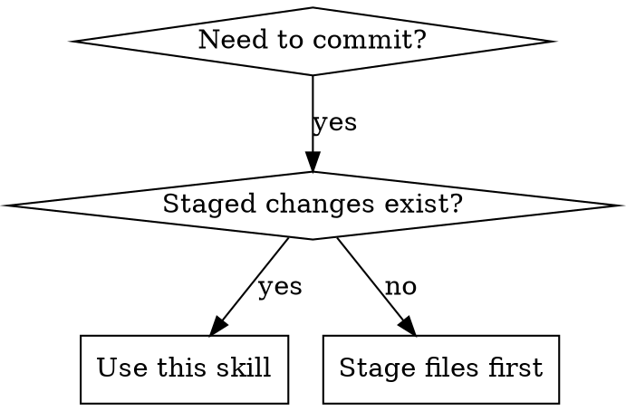

# Conventional Commits Helper

## Overview

Helps create git commits following Conventional Commits specification with extended format support. Analyzes staged changes, guides through required fields (type, scope, subject), and optional fields (body, footer). Ensures commit messages are structured, searchable, and maintainable.

## When to Use



**Use when:**
- Creating a git commit manually (not using an agent)
- Staged changes exist but unsure of commit message format
- Want to follow Conventional Commits specification
- Need to create commit with body and/or footer
- Working on project that requires structured commit messages

**Don't use when:**
- Agent is making commits (agents use git-master skill)
- No staged changes (stage files first with `git add`)

## Core Pattern

### Before
```bash
$ git commit
# User types: "Add login and fix some bugs and update readme"
# Non-standard format, no type, no scope, no structure
# Hard to search and understand later
```

### After
```
feat(auth): add OAuth2 login

Implemented OAuth2 authentication flow with Google and GitHub providers.
Users can now sign in using their existing accounts without creating passwords.

Closes #123
Reviewed-by: @username
```
- Structured, searchable, maintainable
- Clear type and scope for changelog generation
- Body explains context and reasoning

## Quick Reference

### Commit Types

| Type | Use for | Example |
|------|---------|---------|
| `feat` | New feature | `feat(auth): add OAuth2 login` |
| `fix` | Bug fix | `fix(api): handle null response` |
| `refactor` | Code change without feature/fix | `refactor(user): simplify validation` |
| `docs` | Documentation only | `docs(readme): update installation steps` |
| `style` | Formatting, no logic change | `style: format with prettier` |
| `test` | Adding/updating tests | `test(auth): add login tests` |
| `chore` | Maintenance, dependencies | `chore(deps): update lodash` |
| `build` | Build system, dependencies | `build: upgrade webpack to v5` |
| `ci` | CI/CD configuration | `ci: add github actions workflow` |
| `perf` | Performance improvement | `perf(api): optimize queries` |
| `revert` | Revert previous commit | `revert: feat(auth)` |

### Subject Format Rules

```
✅ add login feature
✅ fix null pointer exception
✅ refactor user validation

❌ Add login feature (capitalized)
❌ add login feature. (period at end)
❌ adding login feature (gerund, not imperative)
❌ added login feature (past tense)
```

### Breaking Change Indicators

```
feat!: remove deprecated API
fix(auth)!: change authentication flow

BREAKING CHANGE: The API endpoint /v1/users is removed.
BREAKING CHANGE: Authentication now requires OAuth2.
```

### Footer Examples

```
Closes #123, #456
Refs #789
Reviewed-by: @username
Co-authored-by: Sisyphus <clio-agent@sisyphuslabs.ai>
```

## Implementation

### Phase 1: Analyze Staged Changes

```bash
# Check if staged changes exist
git diff --staged --exit-code
if [ $? -eq 0 ]; then
    echo "No staged changes found. Please stage files first with git add"
    exit 1
fi

# Get file list and statistics
git diff --staged --stat
git diff --staged
git status
```

**Analysis output:**
- List of changed files
- Lines added/removed
- File types (code, config, docs, tests)
- Change scope (small/medium/large)

### Phase 2: Guide User Through Required Fields

**Step 1: Select commit type**

Use question tool with options:
- Provide context about what changed (code/docs/tests/config)
- List valid types with brief descriptions
- Default to `feat` for new code, `fix` for bug fixes

**Step 2: Ask for scope (optional)**

- Free text input
- Provide examples based on changed files (e.g., "auth", "api", "ui")
- Allow empty if scope is not needed

**Step 3: Ask for subject (required)**

- Free text input with validation
- Must be present tense, imperative mood, lowercase first letter
- Max 50 characters (soft limit)
- No period at end
- Show examples: "add login feature", "fix null pointer"

**Step 4: Ask for body (optional)**

- Multi-line text input
- Explain: what was changed and why
- Provide context for reviewers
- Wrap at 72 characters

**Step 5: Ask for footer (optional)**

- Multi-line text input
- Ask about breaking changes
- Ask about issue references (Closes #123)
- Ask about reviewers (Reviewed-by: @username)

### Phase 3: Generate Commit Message

```
format:
<type>(<scope>): <subject>

<body>

<footer>

special cases:
- No scope: <type>: <subject>
- Breaking change: <type>(<scope>)!: <subject>
- No body/footer: <type>(<scope>): <subject>
```

### Phase 4: Preview and Confirm

```
=== COMMIT MESSAGE PREVIEW ===
feat(auth): add OAuth2 login

Implemented OAuth2 authentication flow with Google and GitHub providers.
Users can now sign in using their existing accounts.

Closes #123
================================

Approve this commit message?
[1] Yes, create commit
[2] Edit subject
[3] Edit body
[4] Edit footer
[5] Cancel
```

### Phase 5: Execute Commit

```bash
# Save commit message to temp file
echo "$COMMIT_MESSAGE" > .git/COMMIT_MSG.tmp

# Commit with the message
git commit -F .git/COMMIT_MSG.tmp

# Clean up
rm .git/COMMIT_MSG.tmp

# Show result
git log -1 --stat
```

## Common Mistakes

| Mistake | Why Wrong | Fix |
|---------|-----------|-----|
| "Add feature" (capitalized) | Subject must start lowercase | "add feature" |
| "Adding feature" (gerund) | Use imperative mood | "add feature" |
| "add feature." (period) | Subject should not end with period | "add feature" |
| "update files" (vague) | Subject should be descriptive | "add user authentication" |
| `feat` without subject | Subject is mandatory | `feat: add login` |
| Mixing types in one commit | Commits should be atomic | Split into multiple commits |
| Breaking change without `!` | Breaking changes need indicator | `feat!: remove API` |
| Very long subject (>72 chars) | Hard to read in git log | Keep under 50 chars |

## Red Flags - STOP and Fix

- Subject starts with capital letter → Change to lowercase
- Subject ends with period → Remove it
- Subject uses gerund or past tense → Use imperative present
- No type specified → Must include type (feat, fix, etc.)
- Breaking change without `!` → Add `!` after type/scope
- Commit message is vague ("update files", "fix bug") → Be specific

**All of these mean: Fix before creating commit.**
